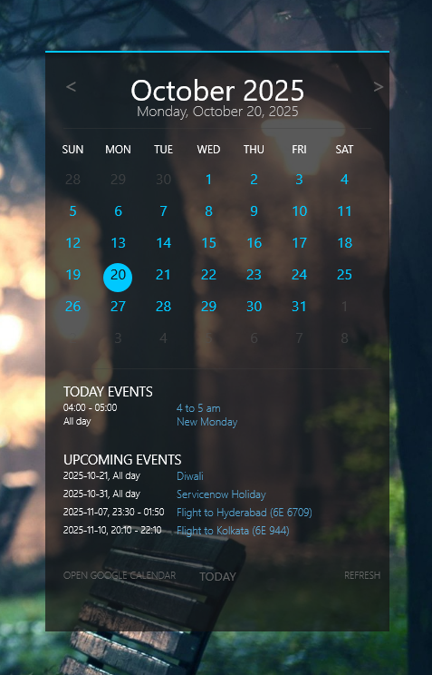

# CyberCalendar - Rainmeter Skin

A sleek, dark-themed calendar skin for Rainmeter that integrates with Google Calendar to display your events directly on your desktop.

## Features

### 📅 Calendar Grid
- Full month view with 6 weeks × 7 days layout
- Blue dates for current month, grey dates for previous/next month
- Cyan circle highlighting today's date
- White circle highlighting selected date (with black text)
- Previous/Next month navigation buttons
- TODAY button to quickly return to current date

### 🖱️ Interactive Date Selection
- All 42 calendar cells are clickable
- Grey dates automatically flip the calendar to show the previous/next month
- Selected date is tracked and displayed throughout the interface
- Visual feedback with white circles and black text

### 📆 Google Calendar Integration
- Fetches events from Google Calendar via ICS feed
- Proper UTC to IST timezone conversion
- Supports both all-day events and timed events
- Real-time event filtering based on selected date

### 📋 Event Display
- **TODAY EVENTS** section displays events for the selected date
- Header dynamically changes to show selected date (e.g., "2025-10-21 EVENTS")
- Each event shows the event name and time
- **UPCOMING EVENTS** section displays future events relative to selection
- Clean, organized layout with proper spacing

### 🎨 Visual Design
- Cyber/dark theme with cyan and white accents
- Color-coded dates (cyan for current month, grey for other months)
- Dark text on cyan/white circles for optimal readability
- Smooth animations and hover effects
- Professional typography and spacing

## Screenshot



## Installation

### Prerequisites
- Rainmeter (latest version)
- Google Calendar with a valid ICS feed URL

### Setup Steps

1. **Extract Files**
   - Extract the CyberCalendar folder to your Rainmeter Skins directory:
     ```
     C:\Users\[YourUsername]\Documents\Rainmeter\Skins\
     ```

2. **Configure Google Calendar ICS URL**
   - Open `Calendar.ini`
   - Find the line: `GoogleCalendarICS=https://...`
   - Replace with your Google Calendar ICS feed URL
   - To get your ICS URL:
     1. Go to Google Calendar settings
     2. Select your calendar
     3. Scroll to "Calendar Address"
     4. Click on the ICS link to copy the URL

3. **Load the Skin**
   - Open Rainmeter
   - Find "CyberCalendar" in the skins list
   - Click "Load" to display the calendar

## Usage

### Navigation
- **Left Arrow (<)**: Go to previous month
- **Right Arrow (>)**: Go to next month
- **TODAY Button**: Return to current date and show today's events

### Date Selection
- **Click any date**: Select that date to view its events
- **Click grey dates**: Automatically navigates to that month
- **Selected date**: Shown with a white circle and black text

### Event Display
- Events for the selected date appear in the "TODAY EVENTS" section
- The header changes to show the selected date (e.g., "2025-10-21 EVENTS")
- Each event shows the time and event name
- All-day events display as "All day"

## File Structure

```
CyberCalender/
├── Calendar.ini          # Main skin configuration
├── @Resources/
│   ├── Calendar.lua      # Calendar grid logic and event parsing
│   └── Parser.lua        # Reference ICS parser (not used)
└── README.md             # This file
```

## Technical Details

### Calendar Logic (Lua)
- **GetDay(index)**: Returns the day number for a calendar cell (0-41)
- **IsInCurrentMonth(index)**: Checks if a date is in the current month
- **IsToday(index)**: Checks if a date is today
- **SetSelectedDate(index)**: Sets the selected date and handles month navigation

### Event Parsing (Lua)
- **parseIcs()**: Parses RFC 5545 ICS format
- **filterEvents()**: Filters events by date
- **convertUtcToIst()**: Converts UTC times to IST with date offset tracking
- **GetParsedResultJson(selectedDate)**: Returns events for a specific date

### Timezone Handling
- Automatically converts UTC times to IST (India Standard Time)
- Handles date changes due to timezone conversion
- Properly filters events by local date after conversion

## Customization

### Colors
Edit the `[Variables]` section in `Calendar.ini`:
```ini
ColorWhite=255,255,255,255
ColorCyan=0,200,255,255
ColorEvent=100,200,255,200
```

### Fonts
```ini
FontFace=Segoe UI Light
FontFaceTitle=Segoe UI
FontFaceDays=Segoe UI
```

### Calendar Position and Size
Edit `[MeterBG]` to change the size and position of the calendar window.

## Troubleshooting

### Events not showing?
1. Verify your Google Calendar ICS URL is correct
2. Check that your calendar is shared publicly
3. Make sure the calendar has events for the selected date
4. Reload the skin: Right-click → Reload

### Dates showing incorrect times?
1. Verify your system timezone is set to IST
2. Check that the calendar events are stored in UTC
3. Manually adjust the timezone offset in the Lua script if needed

### Calendar not updating?
1. Increase the UpdateRate in `[MeasureEventParser]` (currently 300 seconds)
2. Manually refresh: Right-click → Refresh all

## Performance Notes

- Calendar caches parsed events to reduce processing
- ICS feed is fetched every 300 seconds (configurable)
- Supports up to 5 upcoming events display
- Smooth performance even with large calendars

## Future Enhancements

Potential features for future versions:
- Event details modal on click
- Multi-calendar support
- Event color coding by category
- Weather integration
- Quick event creation
- Event notifications

## Known Limitations

- Limited to displaying 5 upcoming events (configurable in code)
- ICS feed must be publicly accessible
- Timezone conversion supports UTC → IST (can be adapted for other timezones)
- No recurring event expansion (shows as single entries)

## Credits

Built with:
- **Rainmeter**: Desktop customization platform
- **Lua**: Scripting language for calendar logic
- **Google Calendar**: Event data source

## License

Free to use and modify for personal use.

## Support

For issues or suggestions:
1. Check the troubleshooting section above
2. Verify all configuration steps are complete
3. Review the Rainmeter error log for detailed messages

---

**Version**: 1.0
**Last Updated**: October 2025
**Tested on**: Rainmeter 4.5+
